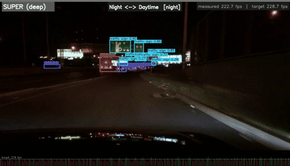
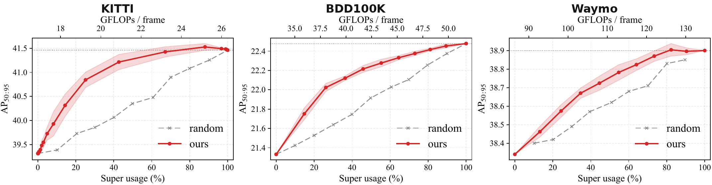

# Dynamic-Depth Routing for Budget-Adaptive Object Detection in ADAS


> A lightweight, per-frame router that dynamically switches between the shallow (**BASE**) and deep (**SUPER**) inference paths of [AnyDepth-YOLO](https://arxiv.org/abs/2605.09407). 
> Control your Latency, FPS, or Energy on-the-fly using a live PI controller—**without retraining.**





## 🏆 Uncompromising Efficiency
Achieve massive compute savings with virtually **zero accuracy drop** (< 0.1 AP).

| Metrics Saved | KITTI | BDD100K | Waymo |
|---|:---:|:---:|:---:|
| ⚡ **Latency** | −12.9% | −17.9% | −20.5% |
| 🔋 **Energy** | −13.0% | −18.2% | −20.5% |

---

## 🚀 Setup

```bash
pip install -r requirements.txt && pip install -e .
```
*(Note: Point `ultralytics/cfg/datasets/{kitti,bdd100k,waymo}.yaml` to your dataset roots and run everything from the repo root. BDD100K is the running example below.)*

---

## Step 1. Finetune AnyDepth-YOLO
[AnyDepth-YOLO](https://arxiv.org/abs/2605.09407) operates at multiple depths using skippable blocks, sharing weights between a shallow **BASE** path and a full-depth **SUPER** path. Since the detector must be frozen during router training, we first finetune the COCO-pretrained model.

Download the COCO-pretrained weights into `results/step1_finetune/pretrained_coco/`:

| Model | COCO AP<sub>50:95</sub> (super / base) | Download |
|---|---|---|
| AnyDepth-YOLOv12**s** (used in paper) | 0.479 / 0.451 | [Link](https://drive.google.com/open?id=1Pkc2Bpna6cvqta4f1XDAvWV0r1zg572c) |
| AnyDepth-YOLOv12**l** | 0.539 / 0.520 | [Link](https://drive.google.com/open?id=14v0eVIYNkpFmB0nz1d9_YaXhYgYFf3hi) |

<details>
<summary><b>Finetuning recipe (Click to expand)</b></summary>

```bash
python -m torch.distributed.run --nproc_per_node 2 step1_finetune/finetune.py \
    --config ultralytics/cfg/models/v12/yolo-ad-v12s-orig.yaml \
    --weight results/step1_finetune/pretrained_coco/yolo-ad-v12-orig_small_0.479_0.451.pt \
    --data ultralytics/cfg/datasets/bdd100k.yaml --dataset bdd100k \
    --imgsz 720 1280
```
*Note: `--dataset` also selects the dataset's `epochs` / `batch` / `lr0`. KITTI and Waymo start from the BDD100K checkpoint rather than COCO; the head is re-initialised when the class count differs.*
</details>

**Or skip this step:** Download the finetuned detector into `results/step1_finetune/weights/<dataset>/best.pt`:

| KITTI | BDD100K | Waymo |
|:---:|:---:|:---:|
| [best.pt](https://drive.google.com/open?id=15TRZFWedlFlbQ0wWIaB1p1_Rg_PU9bQk) | [best.pt](https://drive.google.com/open?id=1UOK6alCcM-919xFa7Vjy7ql4Ppe5cgEQ) | [best.pt](https://drive.google.com/open?id=1WT1o9GV5Z08P7fHTllsHpESOB7YZuXNc) |


## Step 2. Train the Router
Caching runs the frozen detector over the dataset twice. To save time, we highly recommend **downloading the caches** into `results/step2_router/cache/<dataset>/`:

| Dataset | train | val |
|---|---|---|
| **KITTI** | [cache_train_g2x2_both.pt](https://drive.google.com/open?id=1_ZLnp48fXWyFOoNP_16nXgV2j8Nv7XZ0) | [cache_val_g2x2_both.pt](https://drive.google.com/open?id=1U9iSPHxrWmaQptu_q13_9azOIazrH6rn) |
| **BDD100K** | [cache_train_g2x2_both.pt](https://drive.google.com/open?id=1MZDgVF2IwEGed96oSw4OzC-vzKa9FBjR) | [cache_val_g2x2_both.pt](https://drive.google.com/open?id=1UXvxgdpROLfyb17zYq0mWUD7AkzZ7A3I) |
| **Waymo** | [cache_train_g2x2_both.pt](https://drive.google.com/open?id=1RveUTmhNWfINIg6mSdTkhFWGgAByeMnT) | [cache_val_g2x2_both.pt](https://drive.google.com/open?id=1BUxT4Heb3Ham8Q_W1woP5-oN71avJIEk) |

<details>
<summary><b>Router training recipe (Click to expand)</b></summary>

```bash
# 1. Build cache (repeat with --split val; Waymo adds --fp16)
python -m step2_train_router.build_cache \
    --weight results/step1_finetune/weights/bdd100k/best.pt \
    --data ultralytics/cfg/datasets/bdd100k.yaml --dataset bdd100k \
    --split train --imgsz 720 1280 --feat both --grid 2 --batch 16 \
    --out results/step2_router/cache/bdd100k/cache_train_g2x2_both.pt

# 2. Fit the router (takes a few minutes on one GPU)
python -m step2_train_router.train_policy --dataset bdd100k \
    --cache     results/step2_router/cache/bdd100k/cache_train_g2x2_both.pt \
    --val_cache results/step2_router/cache/bdd100k/cache_val_g2x2_both.pt \
    --feat both --norm batch --select val_corr --epochs 30 --seed 0 \
    --out results/step2_router/weights/bdd100k/router_g2x2_both_s0.pt
```
*Note: Weights are named `router_g<H>x<W>_<feat>_s<seed>.pt`. `--feat` supports `backbone`, `neck`, or `both`. Use `--arch gapmlp` to swap TinyConv for the GAP-MLP ablation.*
</details>

**Or skip this step:** Download the trained router into `results/step2_router/weights/<dataset>/`:

| KITTI | BDD100K | Waymo |
|:---:|:---:|:---:|
| [router_g2x2_both_s0.pt](https://drive.google.com/open?id=11HLB7qsu6uLC0iOvFgrhqVCIhaSEH1oU) | [router_g2x2_both_s0.pt](https://drive.google.com/open?id=1503mJt7hkaue41Irp22Ol1NJEpOZRYwH) | [router_g2x2_both_s0.pt](https://drive.google.com/open?id=1nMj0XQpLlFj1IcR94XN-zL9T8hCxAlwM) |


## Step 3. Evaluate the Router
Routing is **causal**: the advantage predicted at frame *t−1* selects the path run at frame *t*.

<details>
<summary><b>Evaluation recipe (Click to expand)</b></summary>

```bash
python -m step3_eval.eval_video --dataset bdd100k \
    --weight    results/step1_finetune/weights/bdd100k/best.pt \
    --policies  "s0=results/step2_router/weights/bdd100k/router_g2x2_both_s0.pt" \
    --val_cache results/step2_router/cache/bdd100k/cache_val_g2x2_both.pt \
    --grid 2 --imgsz 720 1280 --conf 0.25 \
    --budgets 10,20,30,40,50,60,70,80,90 \
    --out results/step3_eval/bdd100k/eval/video_curve.json
```
*Note: The paper averages seeds 0–4 — pass them as a comma-separated `--policies` list. Ablation drivers live in [`step3_eval/ablation/`](step3_eval/ablation/).*
</details>


## Step 4. Deploy
TensorRT cannot skip layers inside a single static engine. Therefore, each depth path becomes its own engine, and the router dynamically selects one per frame.

<details>
<summary><b>Export, build engines, and track a budget (Click to expand)</b></summary>

```bash
# 1. Export + Build
python -m step4_deploy.export_onnx --weight results/step1_finetune/weights/bdd100k/best.pt \
    --imgsz 720 1280 --pool --out_dir results/step4_deploy/onnx/bdd_pooled
    
python -m step4_deploy.export_router_onnx \
    --router results/step2_router/weights/bdd100k/router_g2x2_both_s0.pt \
    --out_dir results/step4_deploy/onnx/bdd_pooled
    
for m in base super router; do
    python -m step4_deploy.build_engine --onnx results/step4_deploy/onnx/bdd_pooled/$m.onnx --fp16
done

# 2. Track a moving budget (renders the demo clip above)
python -m step4_deploy.online_budget_demo_stream \
    --base   results/step4_deploy/onnx/bdd_pooled/base.fp16.engine \
    --super  results/step4_deploy/onnx/bdd_pooled/super.fp16.engine \
    --router results/step2_router/weights/bdd100k/router_g2x2_both_s0.pt \
    --router_engine results/step4_deploy/onnx/bdd_pooled/router.fp16.engine \
    --mode fps --kp 1.0 --ki 1.5 --beta 0.75 --warmup 60 --win 30
```
*Notes:*
* `--mode` is `latency` (ms, default), `fps`, or `energy` (mJ/frame via NVML). 
* *Controller gains:* `--kp 2.0 --ki 0.33 --beta 0.85 --win 30` on Jetson Orin Nano (0.38 fps MAE), and `--kp 1.0 --ki 1.5 --beta 0.75 --win 30` on RTX 3090.
</details>

*(Every script's module docstring carries a runnable `Usage` example!)*

---

## 📄 License
[AGPL-3.0](LICENSE), inherited from Ultralytics.